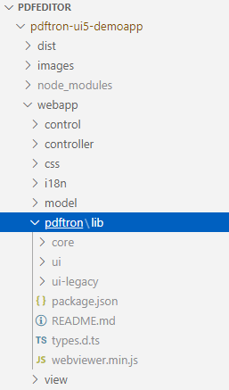
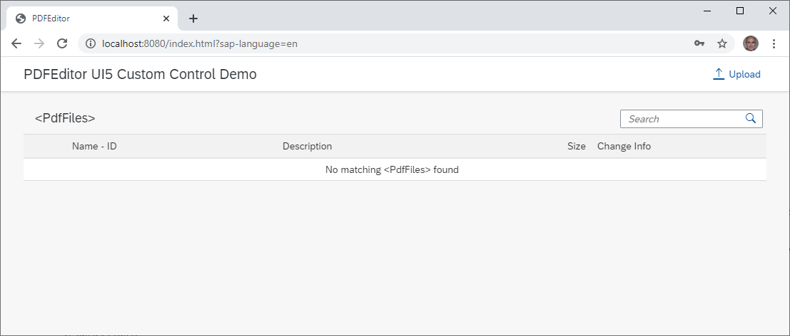
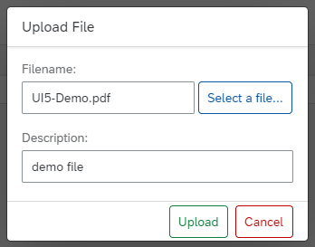
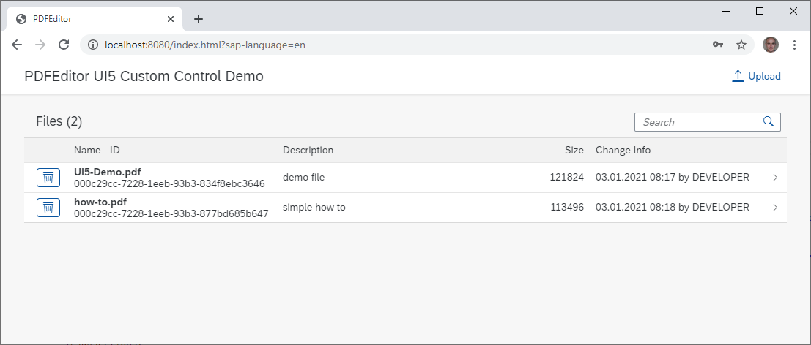
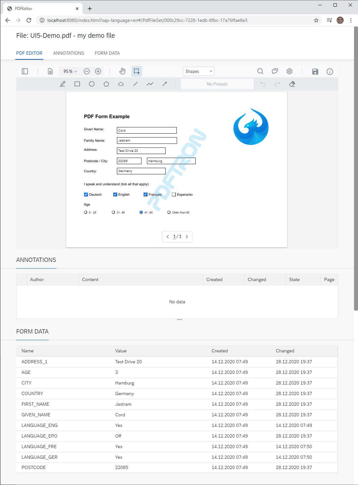

# pdftron-ui5-demoapp

This project wraps the [PDFTron WebViewer](https://www.pdftron.com/webviewer) as an SAP UI5 custom control. For the development I use VSCode. There is a detailed description available from the excellent [blog](https://blogs.sap.com/2020/06/28/installing-visual-studio-code-and-configuring-sap-extensions-in-visual-studio-code) where the installation and initial configuration is described.

## Installation

- Create a new SAPUI5 project using the worklist template as described in another excellent [blog](https://blogs.sap.com/2020/07/18/develop-sap-ui5-apps-using-visual-studio-code) from SaiNithesh Gajula.

- Create a folder named `pdftron` in your webapp folder

- Download the [PDFTron WebViewer](https://www.pdftron.com/downloads/WebViewer.zip) demo version and copy the `lib` folder into the `pdftron` folder.

- Copy the `webapp` folder of the repository to the new project overwriting the existing files

<figure>
  
</figure>

- Install the OData services from [pdftron-ui5-odata](https://github.com/cordjastram/pdftron-ui5-odata) in your SAP system. The services allow you to perform CRUD operations on PDF files in your SAP system.

- Change the baseUri in the ui5.yaml file to your SAP system.

## The demo application

When you start the application you see an empty list of PDF files.

<figure>
  
</figure>

You upload files by clicking on the Upload button in the upper right corner

<figure>
  
</figure>

and after uploading some files they are displayed in the PDF file list.

<figure>
  
</figure>

When you click on an entry of the file list you see a UI5 object page with three sections.

<figure>
  
</figure>

There are three sections. The first section PDF EDITOR consists of the custom control and allows to edit the PDF file. The second section FORM DATA shows the form field data and the third section ANNOTATIONS shows the content of the PDF annotations in a document. An annotation can be a comment for another annotation and therefore I display annotations in a UI5 TreeTable control in order to visualize this hierarchical relationship.

The form field data and the annotation data are written to the SAP database via OData services each time the _Save_ button in the upper right corner of the PDF Edior

## Integrating the control into your own application

When you want to integrate the control into your own application copy the `control` and the `pdftron` folder from the demo application into your project.

To use the control in an XML view you define the alias `pdftron` for the namespace of the control `xmlns:pdftron="your_application.control` and include it in the view in which you want to use the control. In the sample application I use `xmlns:pdftron="com.cjastram.PDFEditor.control`.

```XML
<mvc:View controllerName="com.cjastram.PDFEditor.controller.Object"
	xmlns="sap.uxap"
	xmlns:m="sap.m"
	xmlns:t="sap.ui.table"
	xmlns:pdftron="com.cjastram.PDFEditor.control"
	xmlns:mvc="sap.ui.core.mvc">
```
Now the control can be included in the view via XML. In the XML you also define the additional buttons in the upper right corner of the control. 

```XML
<pdftron:PDFEditor data="{Data}" readonly="{Flattened}" username="{CurrentEditor}" height="70vh" id="pdfEditorId" press="onPdfEditorButtonPress">
	<pdftron:buttons>
		<pdftron:button type="divider" />
		<pdftron:button type="actionButton" image="{pdfeditor>saveIcon}" title="{i18n>save}" name="btnSave" />
		<pdftron:button type="actionButton" image="{pdfeditor>infoIcon}" title="{i18n>info}" name="btnInfo" />
	</pdftron:buttons>
</pdftron:PDFEditor>
```

The images of the buttons are SVG icons taken from the [Material Design](https://material.io/resources/icons) web page and they are located in the file `pdfeditor.properties` located in the `control` folder of the application. I have added a model named `pdfeditor` in the `manifest.json` file which allows to use the model the same way as you use the `i18n` model of SAPUI5. When you need additional icons just add them this file

```Json
"models": {
	"pdfeditor": {
		"type": "sap.ui.model.resource.ResourceModel",
		"settings": {
			"bundleName": "com.cjastram.PDFEditor.control.pdfeditor"
		}
	}
```
```Text
# This is the resource bundle with icons for PDFEditor
#~~~~ Custom Icons ~~~~~~~~~~~~~~~~~~~~~~~~~~~~~
saveIcon=<svg xmlns="http://www.w3.org/2000/svg" viewBox="0 0 24 24" width="24"><path d="M0 0h24v24H0z" fill="none"/><path d="M17 3H5c-1.11 0-2 .9-2 2v14c0 1.1.89 2 2 2h14c1.1 0 2-.9 2-2V7l-4-4zm-5 16c-1.66 0-3-1.34-3-3s1.34-3 3-3 3 1.34 3 3-1.34 3-3 3zm3-10H5V5h10v4z"/></svg>
infoIcon=<svg xmlns="http://www.w3.org/2000/svg" height="24" viewBox="0 0 24 24" width="24"><path d="M0 0h24v24H0V0z" fill="none"/><path d="M11 7h2v2h-2zm0 4h2v6h-2zm1-9C6.48 2 2 6.48 2 12s4.48 10 10 10 10-4.48 10-10S17.52 2 12 2zm0 18c-4.41 0-8-3.59-8-8s3.59-8 8-8 8 3.59 8 8-3.59 8-8 8z"/></svg>
```
